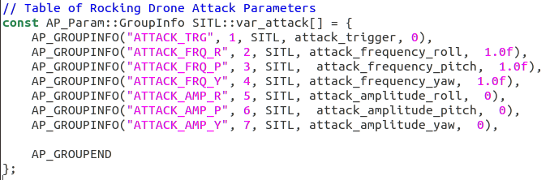
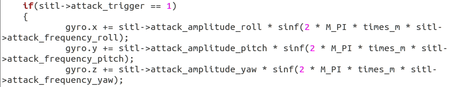

# ArduPilot Rocking Drone

## Outline
This project mimics "Rocking Drones with Intentional Sound Noise on Gyroscopic Sensors(2005) Y Son et al."
In this project, a sinusoidal error is added to gyro when the attack flag is 1(ON).
It adds this function to ardupilot project, simulates this attack, and analyzes the results.

## Develop

1. Add parameters

Go to ```ardupilot/libraries/SITL```

In SITL.h, adds following parameters into the SITL class.
```C
    AP_Int8  attack_trigger;
    AP_Float attack_frequency_roll; 
    AP_Float attack_frequency_pitch;
    AP_Float attack_frequency_yaw;
    AP_Float attack_amplitude_roll;
    AP_Float attack_amplitude_pitch;
    AP_Float attack_amplitude_yaw;
```

attack trigger represents the attack status(ON/OFF).
Other paramters are for attack frequency and amplitude.

In SITL.cpp, adds extra table and parameters to the extended table.

Adding table is done by adding AP_SUBGROUPEXTENSION to the suitable table.
In my case, I added a subgroup to var_info2 by adding it to the table.

```AP_SUBGROUPEXTENSION("",     5, SITL,  var_attack)```

Use a contents number that is not in use(in my case 5).

Finally, fill in the extended table with ```AP_GROUPINFO```
The newly added params must be in the SITL group.



2. Modify gyro value

Go to ```ardupilot/libraries/SITL```

To reflect sinusoidal error into the gyro value, you should modify the gyro value in the ```fill_fdm``` function in the ```SIM_Aircraft.cpp```



To use ```M_PI``` (pi), include <math.h> library and add ```#define _USE_MATH_DEFINES``` 

In this step, if the value of ```sitl->attack_trigger``` is 1(ON), it gets attack frequency and amplitude from sitl and it adds the sinusoidal error to all axis of gyro value.

3. Add tests to arducopter.py

We will add two tests.

The first test is ```fly_rocking_drone``` test and, it hovers the drone and then, change the attack_trigger value to 1(ON) and gets the rotor values from the drone.

```Python
    def fly_rocking_drone(self,
                          timeout=200):
        self.progress('Start Rocking Drone attack')

        tstart = self.get_sim_time()
        tflag = tstart
        last_status = 1

        attack_amp = 500
        attack_freq = 100

        #self.mavproxy.send('param set SIM_ATTACK_TRG 0\n')
        self.set_parameter("SIM_ATTACK_TRG", 0)

        self.assert_vehicle_location_is_at_startup_location()

        self.takeoff(40)
        self.hover()
        #self.mavproxy.send('param set SIM_ATTACK_AMP_Y %f\n' % attack_amp)
        #self.mavproxy.send('param set SIM_ATTACK_FRQ_Y %f\n' % attack_freq)
        self.set_parameter("SIM_ATTACK_AMP_Y", attack_amp)
        self.set_parameter("SIM_ATTACK_FRQ_Y", attack_freq)
            
        self.set_parameter("SIM_ATTACK_TRG", 1)
        while self.get_sim_time_cached() < tstart + timeout:
		servo = self.mav.recv_match(type = 'SERVO_OUTPUT_RAW',
                                             blocking=True)
                self.progress("Rotor %d's speed: %d" % (1, servo.servo1_raw))
		self.progress("Rotor %d's speed: %d" % (2, servo.servo2_raw))
		self.progress("Rotor %d's speed: %d" % (3, servo.servo3_raw))
		self.progress("Rotor %d's speed: %d" % (4, servo.servo4_raw))
        

        self.set_parameter("SIM_ATTACK_TRG", 0)


        self.zero_throttle()

        # wait for disarm
        self.wait_disarmed()
        self.progress("MOTORS DISARMED OK")

        self.progress("Rocking Drone test is done.")
```
You can freely change ```timeout, attack_amp, attack_freq```

The second test is ```simple_hover_test``` and, it just hovers the drone and gets rotor values fron the drone.
```Python
    def simple_hover_test(self,
                          timeout=200):
        self.progress('Start Simple Hover Test')

        tstart = self.get_sim_time()
        tflag = tstart

        self.takeoff(40)
        self.hover()

        while self.get_sim_time_cached() < tstart + timeout:
		servo = self.mav.recv_match(type = 'SERVO_OUTPUT_RAW',
                                             blocking=True)
                self.progress("Rotor %d's speed: %d" % (1, servo.servo1_raw))
		self.progress("Rotor %d's speed: %d" % (2, servo.servo2_raw))
		self.progress("Rotor %d's speed: %d" % (3, servo.servo3_raw))
		self.progress("Rotor %d's speed: %d" % (4, servo.servo4_raw))

        self.zero_throttle()

        # wait for disarm
        self.wait_disarmed()
        self.progress("MOTORS DISARMED OK")

        self.progress("Simple hover test is done.")

```
You can freely change ```timeout```

4. Set essential/useless tests in autotest.py

There are too many useless tests in autotest.py so, we should comment that tests to save time.


## Result
